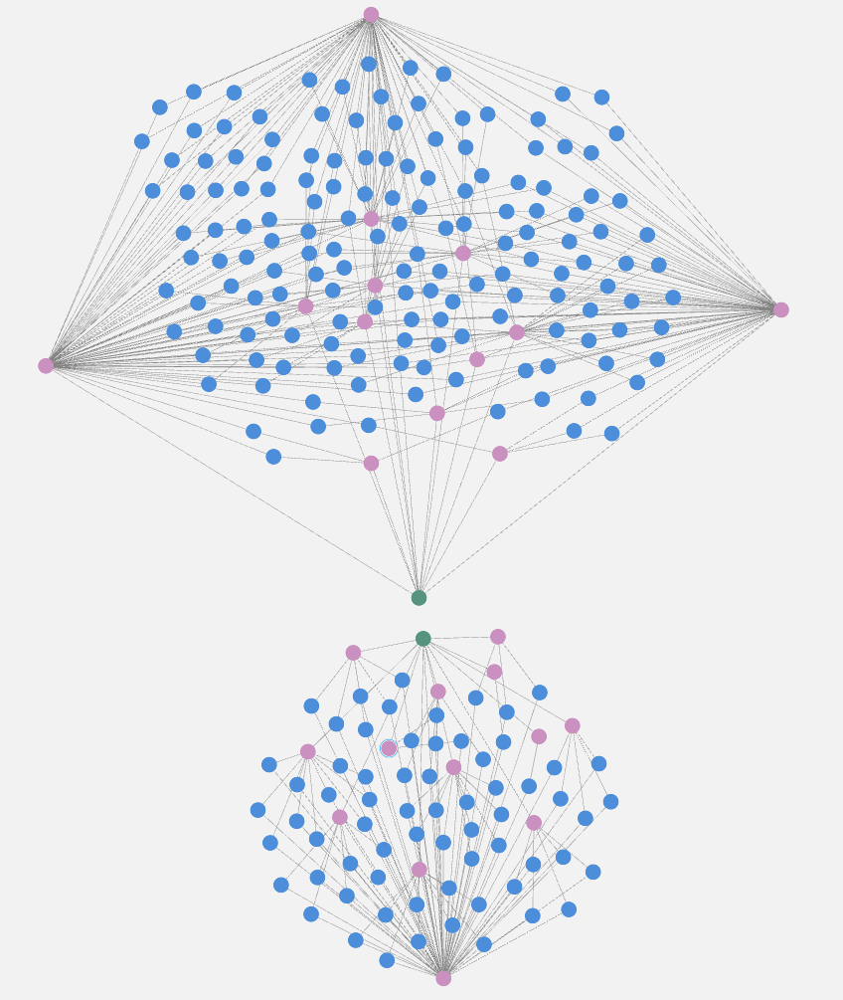

# DB-Neo4JAssignment

## Run
```
$ docker compose up
```

### Import Data
Creates each node and relationship between them
```cypher
LOAD CSV WITH HEADERS FROM 'https://raw.githubusercontent.com/metrica-sports/sample-data/master/data/Sample_Game_1/Sample_Game_1_RawEventsData.csv' AS row
MERGE (tea:Team {name: row.Team})

MERGE (g:Game {name: 'Game 1'})
MERGE (tea)-[:PLAYS_IN]->(g)

MERGE (typ:Event {name: row.Type, startTime: row.`Start Time [s]`, endTime: row.`End Time [s]`})
MERGE (typ)-[:IN {period: row.Period}]->(g)

MERGE (pFrom:Player {name: row.From})
MERGE (pFrom)-[:PLAYS_ON]->(tea)
MERGE (pFrom)-[:CAUSED]->(typ)

FOREACH (ignore in CASE WHEN exists(row.To) THEN [1] ELSE [] END | 
    MERGE (pTo:Player {name: row.To})
    MERGE (pTo)-[:PLAYS_ON]->(tea)
    MERGE (typ)-[:RECIVES]->(pTo)
)

WITH row 
WHERE NOT row.Subtype IS NULL
MATCH (evn:Event {startTime: row.`Start Time [s]`, endTime: row.`End Time [s]`})
UNWIND split(row.Subtype, '-') AS subtype
MERGE (se:SubEvent {name: subtype})
MERGE (evn)-[:IS_ALSO]->(se)
```

_NOTE: Because of the way the csv data is structed, the current graph model shows both WON and LOSS  as Subtype nodes of a single CHALLENGE node. This _

# Graph Model


# Usage

## Most passes and recives

```cypher
MATCH (p:Player)-[:CAUSED]->(e:Event)-[:RECIVES]->(p2:Player)
RETURN p.name AS name, count((p)-[:RECIVES]->(e)) as pass_count
ORDER BY pass_count DESC
```

```cypher
MATCH (p:Player)-[:CAUSED]->(e:Event)-[:RECIVES]->(p2:Player)
RETURN p2.name AS name, count((e)-[:RECIVES]->(p2)) as recive_count
ORDER BY recive_count DESC
```

 

If we look at the four players with most recives we get the graph below. 
The top cluster is the _home_ team, and the bottom is the _away_ team.

We can see the passes from each player is prette even, with the exception of one player on the away team that never pass or recived the ball to either of the two players.


The four players with most passes gives us a little diffrent picture. As before, the top team is the _home_ team and the bottom is the _away_ team.



In termes of passes, the home team seemes to be the best in that regard, and we go down the list to find the player on the _away_ team with second most passes its Player16 at place number 8 in the list.

The home team just seem to have more passes between each other compared to the away team.

## Goals and attempts

Here is all goals and attempted goals. There are a total of 11 attempts, 4 of which resulted in a goal.  


By including the players and their team we get a better understanding of how the match went.


The attempts were performed by a total of 7 players, three of which plays on the _away_ team and other four on the _home_ team.

All goals went to the _home_ team and it looks like it was a rough match for the _away_ team since they only made three attempts in total.
We can also see that Player9 attemped to score three times and two of his attempted resulted in goals. 

## Which team had the ball longest?
## Is there any close ‘societies’ between players? (passing the ball to each other)
## How close is the connection between two specific players?